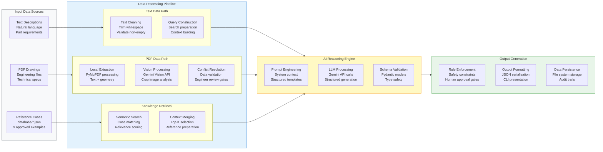
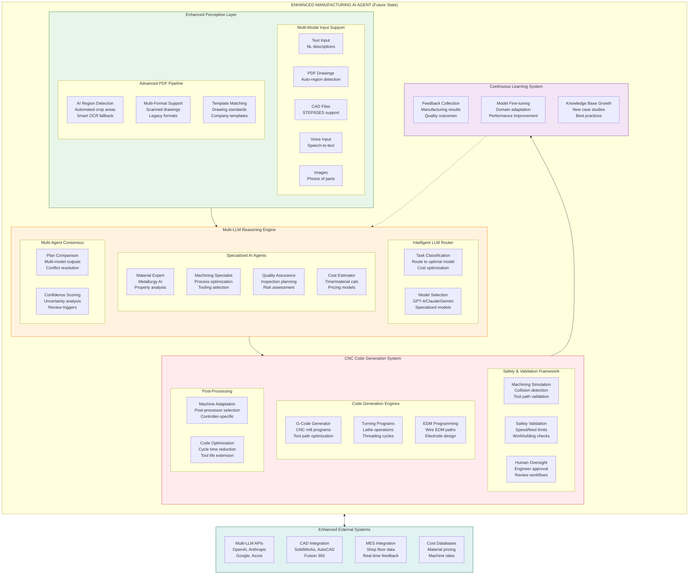
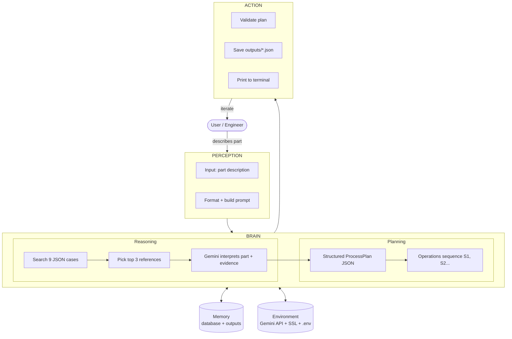
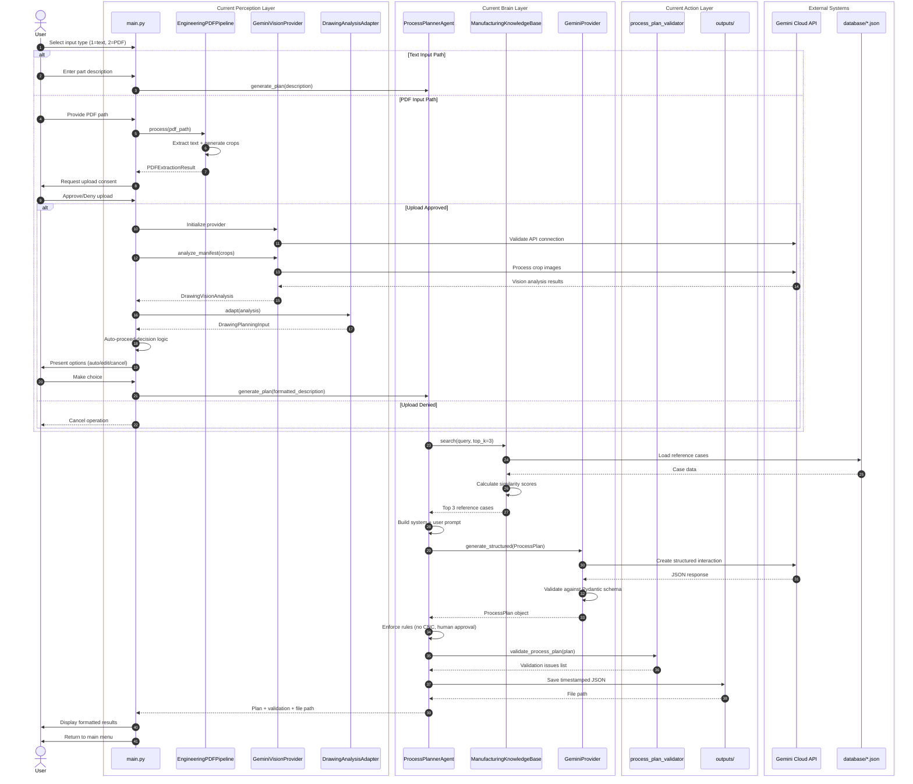
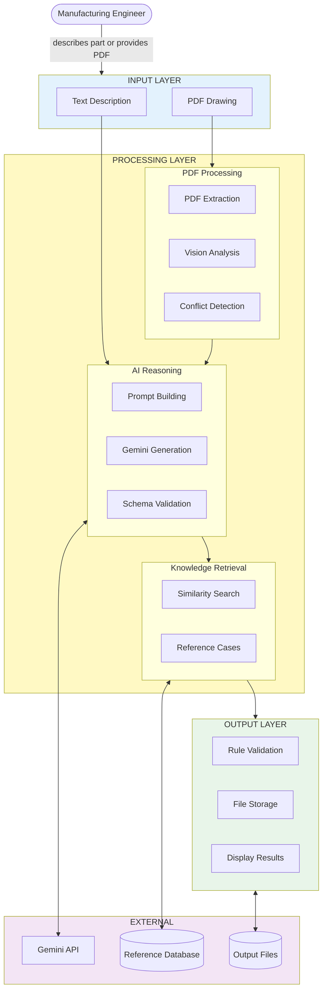

# Manufacturing Agent — Updated Flow Diagram & Future Roadmap

> **Last Updated:** July 21, 2026  
> **Visual diagram image:** `assets/manufacturing_agent_flow_diagram.png`

This diagram reflects the current **Perception → Brain → Action** agent architecture with dual input paths (Text + PDF), mapped to the actual codebase, plus future expansion plans for multi-LLM support and CNC code generation.

---

## 1. Current System Architecture (Dual Input Paths)

```mermaid
flowchart TB
    subgraph ITERATE[" "]
        direction LR
        ITER["Iterate<br/>(next user query)"]
    end

    subgraph AGENT["MANUFACTURING AI AGENT (main.py + app/)"]
        direction TB

        subgraph PERCEPTION["Perception Layer"]
            direction TB
            
            subgraph INPUT_SELECTION["Input Selection"]
                direction LR
                MENU["CLI Menu<br/>1) Text description<br/>2) PDF drawing<br/>3) exit"]
                TEXT_IN["Text Input<br/>Natural language<br/>part description"]
                PDF_IN["PDF Input<br/>Engineering drawing<br/>file path"]
                MENU --> TEXT_IN
                MENU --> PDF_IN
            end

            subgraph TEXT_PATH["Text Processing Path"]
                direction LR
                FMT["Input Validation<br/>Strip whitespace<br/>Check empty"]
                CONTEXT["Direct to Brain<br/>Raw text description"]
                TEXT_IN --> FMT --> CONTEXT
            end

            subgraph PDF_PATH["PDF Processing Pipeline"]
                direction TB
                
                subgraph PHASE1["Phase 1: Local Extraction (pymupdf_pipeline.py)"]
                    direction LR
                    PDF_LOAD["PDF Loader<br/>File validation<br/>Size/page limits"]
                    TEXT_EXTRACT["Text Extraction<br/>Native PDF text<br/>Geometry analysis"]
                    CROP_GEN["Crop Generation<br/>Engineering regions<br/>Title blocks, tables"]
                    PDF_IN --> PDF_LOAD --> TEXT_EXTRACT --> CROP_GEN
                end
                
                subgraph CONSENT["User Consent & Privacy"]
                    direction LR
                    CONSENT_CHK["Upload Consent<br/>Gemini API warning<br/>Confidential data notice"]
                    CROP_GEN --> CONSENT_CHK
                end
                
                subgraph PHASE2["Phase 2: Vision Analysis"]
                    direction TB
                    VISION_INIT["GeminiVisionProvider<br/>Lazy initialization<br/>API key validation"]
                    CROP_ANALYSIS["GeminiCropAnalyzer<br/>Multi-crop analysis<br/>Fail-fast mode"]
                    MERGE_RESULTS["Result Merger<br/>Consolidate vision data<br/>Conflict detection"]
                    CONSENT_CHK --> VISION_INIT --> CROP_ANALYSIS --> MERGE_RESULTS
                end
                
                subgraph ADAPTER["Drawing Analysis Adapter"]
                    direction LR
                    ADAPT_LOGIC["DrawingAnalysisAdapter<br/>Vision → Planning format<br/>Confidence scoring"]
                    CONFLICT_DETECT["Critical Conflict Detection<br/>Inconsistencies<br/>Missing data"]
                    AUTO_PROCEED["Auto-proceed Logic<br/>Confidence thresholds<br/>Manual review gates"]
                    FORMAT_OUTPUT["Format Planning Description<br/>Structured text output"]
                    MERGE_RESULTS --> ADAPT_LOGIC --> CONFLICT_DETECT --> AUTO_PROCEED --> FORMAT_OUTPUT
                end
            end

            FORMAT_OUTPUT --> BRAIN_INPUT["Combined Context<br/>for Manufacturing Brain"]
            CONTEXT --> BRAIN_INPUT
        end

        subgraph BRAIN["Manufacturing Brain"]
            direction TB

            subgraph KNOWLEDGE["Knowledge Retrieval"]
                direction LR
                KB_SEARCH["Knowledge Base Search<br/>ManufacturingKnowledgeBase<br/>Semantic similarity"]
                REF_SELECT["Reference Selection<br/>Top-K scoring<br/>Case relevance"]
                BRAIN_INPUT --> KB_SEARCH --> REF_SELECT
            end

            subgraph REASONING["LLM Reasoning & Planning"]
                direction TB
                PROMPT_BUILD["Prompt Construction<br/>System + User prompt<br/>Reference cases context"]
                LLM_CALL["Gemini LLM Call<br/>Structured generation<br/>ProcessPlan schema"]
                SCHEMA_VALID["Schema Validation<br/>Pydantic model<br/>Type checking"]
                REF_SELECT --> PROMPT_BUILD --> LLM_CALL --> SCHEMA_VALID
            end
        end

        subgraph ACTION["Action & Output"]
            direction TB
            ENFORCE["Rule Enforcement<br/>CNC code: not_generated<br/>Human approval: required"]
            VALIDATE["Process Validation<br/>Business rule checks<br/>Safety requirements"]
            SAVE_JSON["Save Results<br/>Timestamped JSON<br/>outputs/ directory"]
            DISPLAY["CLI Display<br/>Formatted output<br/>Validation results"]
            SCHEMA_VALID --> ENFORCE --> VALIDATE --> SAVE_JSON --> DISPLAY
        end
    end

    subgraph EXTERNAL["External Systems"]
        direction TB
        GEMINI_API["Gemini Cloud API<br/>Text & Vision models<br/>Structured generation"]
        FILE_SYSTEM["File System<br/>database/ (reference cases)<br/>outputs/ (generated plans)<br/>mech_drw/ (input PDFs)"]
        ENV_CONFIG["Environment<br/>.env (API keys)<br/>SSL certificates<br/>Python runtime"]
    end

    DISPLAY --> ITER
    ITER -.->|user selects| MENU

    BRAIN <--> GEMINI_API
    AGENT <--> FILE_SYSTEM
    AGENT <--> ENV_CONFIG

    style PERCEPTION fill:#e3f2fd,stroke:#1976d2
    style BRAIN fill:#fff9c4,stroke:#f9a825
    style ACTION fill:#e8f5e9,stroke:#43a047
    style PDF_PATH fill:#fff3e0,stroke:#ef6c00,stroke-width:2px
    style AGENT stroke:#333,stroke-dasharray: 8 4
    style EXTERNAL fill:#f3e5f5,stroke:#7b1fa2
```



---

## 2. Current Data Pipeline Architecture



---

## 3. Future System Architecture (Multi-LLM & CNC Integration)





---

## 4. Future Development Roadmap

### Phase 1: Multi-LLM Integration (Next 3-6 months)

#### 1.1 LLM Provider Abstraction Enhancement
- **Current State**: Single Gemini provider with basic abstraction
- **Target**: Unified interface supporting multiple providers
- **Implementation**:
  ```python
  # Enhanced base provider with routing capabilities
  class EnhancedLLMProvider:
      def route_request(self, task_type: str, complexity: float) -> str
      def generate_with_fallback(self, providers: list[str]) -> Any
      def cost_optimize(self, budget_constraints: dict) -> str
  ```

#### 1.2 Provider Implementation Priorities
1. **OpenAI Integration** (GPT-4, GPT-4-Turbo)
   - Structured output support
   - Function calling capabilities
   - Cost optimization features
   
2. **Anthropic Claude Integration**
   - Claude-3 Sonnet/Opus support
   - Large context window utilization
   - Enhanced reasoning capabilities
   
3. **Azure OpenAI Service**
   - Enterprise-grade deployment
   - Data residency compliance
   - Enhanced security features

#### 1.3 Intelligent Model Selection
- **Task Classification**: Route different tasks to optimal models
- **Cost-Performance Optimization**: Balance quality vs. cost
- **Fallback Mechanisms**: Automatic failover on errors
- **A/B Testing Framework**: Compare model performance

### Phase 2: Advanced PDF Processing (6-9 months)

#### 2.1 AI-Powered Region Detection
```python
class AIRegionDetector:
    def detect_title_blocks(self, page_image: Image) -> list[BoundingBox]
    def identify_dimension_tables(self, page_image: Image) -> list[Region]
    def extract_drawing_views(self, page_image: Image) -> list[DrawingView]
    def classify_drawing_type(self, pdf: PDFDocument) -> DrawingType
```

#### 2.2 Enhanced OCR Pipeline
- **Tesseract Integration**: Fallback for scanned drawings
- **Specialized OCR Models**: Engineering text recognition
- **Multi-language Support**: International drawing standards
- **Handwritten Text Recognition**: Legacy drawing support

#### 2.3 Drawing Standards Compliance
- **ISO Standards**: ISO 128, ISO 14405 support
- **ASME Standards**: Y14.5 GD&T interpretation
- **Company Templates**: Custom drawing formats
- **Automated Validation**: Standards compliance checking

### Phase 3: CNC Code Generation Framework (9-18 months)

#### 3.1 Safety-First Architecture
```python
class CNCGenerationFramework:
    def validate_safety(self, plan: ProcessPlan) -> SafetyReport
    def simulate_machining(self, gcode: str) -> SimulationResult
    def require_human_approval(self, risk_level: RiskLevel) -> ApprovalWorkflow
    def generate_with_constraints(self, safety_limits: SafetyLimits) -> GCode
```

#### 3.2 Progressive Complexity Support
1. **Level 1**: Simple drilling operations only
2. **Level 2**: Basic milling (pockets, profiles)
3. **Level 3**: Turning operations
4. **Level 4**: Complex multi-axis operations
5. **Level 5**: Automated tool path optimization

#### 3.3 Machine-Specific Post-Processors
- **Haas Controllers**: VF series, ST series support
- **Fanuc Controllers**: 0i, 30i, 31i, 32i support
- **Siemens Controllers**: 840D, 828D support
- **Mazak Controllers**: Matrix, SmoothX support

#### 3.4 Simulation & Validation
```python
class MachiningSimulator:
    def load_machine_model(self, machine_type: str) -> MachineModel
    def simulate_toolpath(self, gcode: str) -> SimulationResult
    def detect_collisions(self) -> list[Collision]
    def optimize_cycle_time(self) -> OptimizedProgram
    def validate_workholding(self) -> WorkholdingReport
```

### Phase 4: Specialized AI Agents (12-24 months)

#### 4.1 Material Science Agent
```python
class MaterialExpertAgent:
    def analyze_properties(self, material: str, application: str) -> MaterialAnalysis
    def recommend_heat_treatment(self, requirements: Requirements) -> HeatTreatment
    def predict_machining_behavior(self, material: Material) -> MachinabilityReport
    def suggest_alternatives(self, constraints: Constraints) -> list[Material]
```

#### 4.2 Machining Optimization Agent
```python
class MachiningOptimizer:
    def optimize_tool_selection(self, operation: Operation) -> ToolRecommendation
    def calculate_speeds_feeds(self, tool: Tool, material: Material) -> CuttingParams
    def minimize_cycle_time(self, operations: list[Operation]) -> OptimizedSequence
    def predict_tool_life(self, conditions: CuttingConditions) -> ToolLifePrediction
```

#### 4.3 Quality Assurance Agent
```python
class QualityAgent:
    def design_inspection_plan(self, requirements: Requirements) -> InspectionPlan
    def predict_quality_risks(self, process: ProcessPlan) -> RiskAssessment
    def recommend_spc_points(self, operations: list[Operation]) -> SPCPlan
    def validate_capability(self, process: Process, requirements: Requirements) -> Capability
```

### Phase 5: Advanced Learning & Integration (18-36 months)

#### 5.1 Continuous Learning Framework
```python
class LearningSystem:
    def collect_manufacturing_feedback(self, job_id: str) -> FeedbackData
    def analyze_quality_outcomes(self, results: ManufacturingResults) -> Insights
    def update_knowledge_base(self, new_cases: list[Case]) -> None
    def fine_tune_models(self, feedback: FeedbackDataset) -> ModelUpdate
```

#### 5.2 Enterprise Integration
- **ERP Integration**: SAP, Oracle connectivity
- **MES Integration**: Shop floor data collection
- **PLM Integration**: Product lifecycle management
- **Quality Systems**: Statistical process control

#### 5.3 Advanced Analytics
- **Predictive Maintenance**: Machine condition monitoring
- **Cost Optimization**: Real-time cost tracking
- **Performance Analytics**: Process improvement insights
- **Supply Chain Integration**: Material availability optimization

---

## 5. Implementation Priority Matrix

| Feature Category | Priority | Complexity | Business Impact | Timeline |
|------------------|----------|------------|----------------|----------|
| Multi-LLM Support | HIGH | Medium | High | 3-6 months |
| Enhanced PDF Processing | HIGH | High | High | 6-9 months |
| Basic CNC Generation | MEDIUM | Very High | Very High | 12-18 months |
| Specialized Agents | MEDIUM | High | Medium | 12-24 months |
| Learning Framework | LOW | High | Medium | 18-36 months |
| Enterprise Integration | LOW | Medium | High | 24-36 months |

---

## 6. Technical Debt & Refactoring Needs

### Current System Improvements
1. **Error Handling**: More robust exception handling across all modules
2. **Logging**: Comprehensive logging framework implementation
3. **Testing**: Expanded test coverage beyond current pytest suite
4. **Configuration**: Centralized configuration management
5. **Performance**: Caching and optimization for large PDF processing
6. **Security**: Enhanced API key management and data encryption

### Code Architecture Enhancements
```python
# Example: Enhanced provider architecture
class LLMProviderManager:
    def __init__(self):
        self.providers = {}
        self.router = IntelligentRouter()
        self.fallback_chain = FallbackChain()
    
    async def generate_structured(
        self, 
        task: Task, 
        model_preferences: ModelPreferences = None
    ) -> StructuredOutput:
        optimal_provider = self.router.select_provider(task, model_preferences)
        try:
            return await optimal_provider.generate(task)
        except Exception as e:
            return await self.fallback_chain.handle_failure(task, e)
```

---

## 7. Success Metrics & KPIs

### Current System Metrics
- **Plan Generation Success Rate**: Currently ~95% for text input
- **PDF Processing Success Rate**: Currently ~85% for engineering drawings
- **User Satisfaction**: Manual review acceptance rate
- **Processing Time**: Average time per plan generation

### Future System Metrics
- **Multi-Model Consensus Score**: Agreement between different LLMs
- **CNC Code Safety Score**: Simulation-based safety validation
- **Learning Effectiveness**: Improvement rate from feedback
- **Cost Optimization**: Reduction in LLM API costs through routing
- **End-to-End Automation**: Percentage of jobs requiring minimal human intervention

---

## 8. Risk Mitigation Strategies

### Technical Risks
1. **LLM API Reliability**: Multi-provider fallback mechanisms
2. **CNC Safety**: Extensive simulation and validation
3. **Data Privacy**: Local processing options for sensitive drawings
4. **Model Accuracy**: Continuous validation against known good results

### Business Risks
1. **Liability**: Human oversight requirements for all generated code
2. **Adoption**: Gradual rollout with extensive training
3. **Integration**: Backward compatibility with existing workflows
4. **Cost Control**: Budget limits and cost monitoring

This roadmap provides a comprehensive path from the current single-LLM system to a sophisticated multi-agent manufacturing AI platform with CNC generation capabilities, while maintaining safety and reliability as top priorities.

---

## 9. Current System Step-by-Step Pipeline



---

## 10. Simplified Current System View



---

## 11. File-to-System Component Mapping

| System Component | Current Files | Future Enhancements |
|------------------|---------------|-------------------|
| **Main Controller** | `main.py` | Multi-modal input handler, workflow orchestrator |
| **PDF Processing** | `app/document_processing/pymupdf_pipeline.py`<br/>`app/document_processing/gemini_crop_analyzer.py`<br/>`app/document_processing/drawing_analysis_adapter.py` | AI region detection, OCR fallback, template matching |
| **LLM Integration** | `app/llm/gemini_provider.py`<br/>`app/llm/gemini_vision_provider.py`<br/>`app/llm/base_provider.py` | Multi-provider support, intelligent routing, fallback chains |
| **Knowledge Management** | `app/services/knowledge_base.py`<br/>`database/*.json` | Vector embeddings, semantic search, dynamic case learning |
| **Process Planning** | `app/agents/process_planner.py`<br/>`app/models/process_plan.py` | Specialized agents, consensus mechanisms, optimization |
| **Validation & Safety** | `app/validation/process_plan_validator.py` | CNC safety framework, simulation integration, risk assessment |
| **Data Models** | `app/models/*.py` | Enhanced schemas, multi-format support, validation rules |

---

## 12. Technology Stack Evolution

### Current Stack
```yaml
Core Language: Python 3.13+
PDF Processing: PyMuPDF
AI/ML: Google Gemini (Text + Vision)
Data Validation: Pydantic v2
File Formats: JSON, PDF
Environment: Windows, .venv
```

### Future Stack Additions
```yaml
Additional LLMs: 
  - OpenAI GPT-4/GPT-4-Turbo
  - Anthropic Claude-3 (Sonnet/Opus)
  - Azure OpenAI Service
  - Local models (Ollama integration)

Enhanced Processing:
  - Tesseract OCR
  - OpenCV for image processing
  - NumPy for numerical computations
  - Scikit-learn for ML features

CNC Generation:
  - CAM libraries (OpenCAMLib)
  - Machining simulation engines
  - G-code validation tools
  - Post-processor frameworks

Enterprise Integration:
  - FastAPI for REST APIs
  - PostgreSQL for enterprise data
  - Redis for caching
  - Docker for deployment
```

---

## 13. Getting Started with Current System

### Prerequisites
```bash
# Ensure Python 3.13+ is installed
python --version

# Navigate to project directory
cd C:\Users\Harsh\Desktop\Agent

# Activate virtual environment
.\.venv\Scripts\activate

# Verify dependencies
pip list
```

### Running the System
```bash
# Start the manufacturing agent
python main.py

# Follow the prompts:
# 1) Enter "1" for text description
# 2) Enter "2" for PDF drawing analysis
# 3) Enter "exit" to quit
```

### Example Workflows

#### Text Input Example
```
Select input type:
  1) Text description
  2) Engineering drawing PDF

Enter 1 or 2 (or type exit): 1
Describe the new part or process: I need to make a steel shaft, 20mm diameter, 100mm long, with a keyway

# System will search reference cases, generate plan, and display results
```

#### PDF Input Example
```
Select input type:
  1) Text description  
  2) Engineering drawing PDF

Enter 1 or 2 (or type exit): 2
Enter the PDF path.
Press Enter to use: mech_drw\VI-RAH-25-73-09-03-05-R2-1.pdf
PDF path: [Press Enter or enter custom path]

# System will process PDF, request upload consent, analyze with vision AI,
# detect conflicts, and guide you through resolution options
```

This comprehensive update reflects the current system architecture while providing a clear roadmap for future enhancements including multi-LLM support, advanced CNC generation, and continuous learning capabilities.
