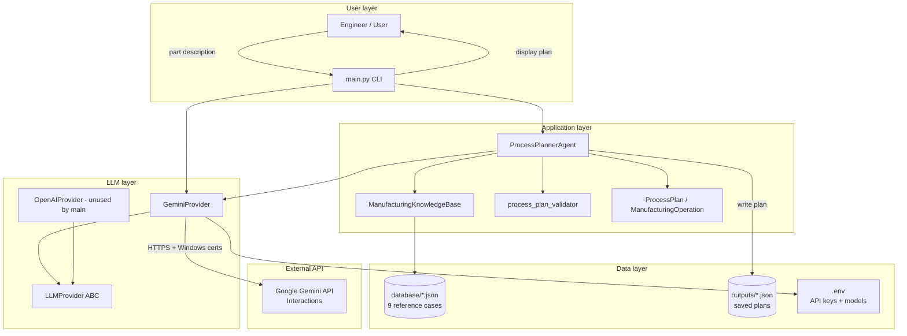
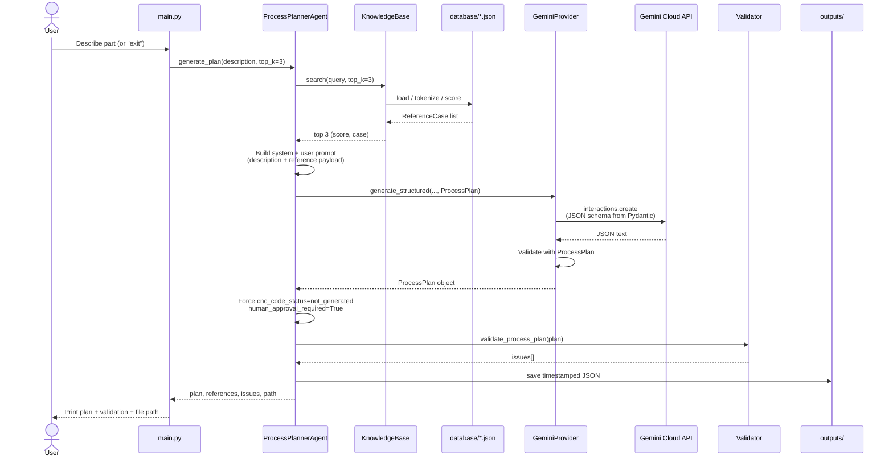
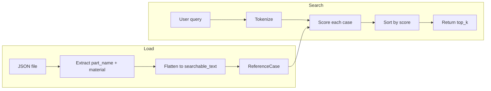
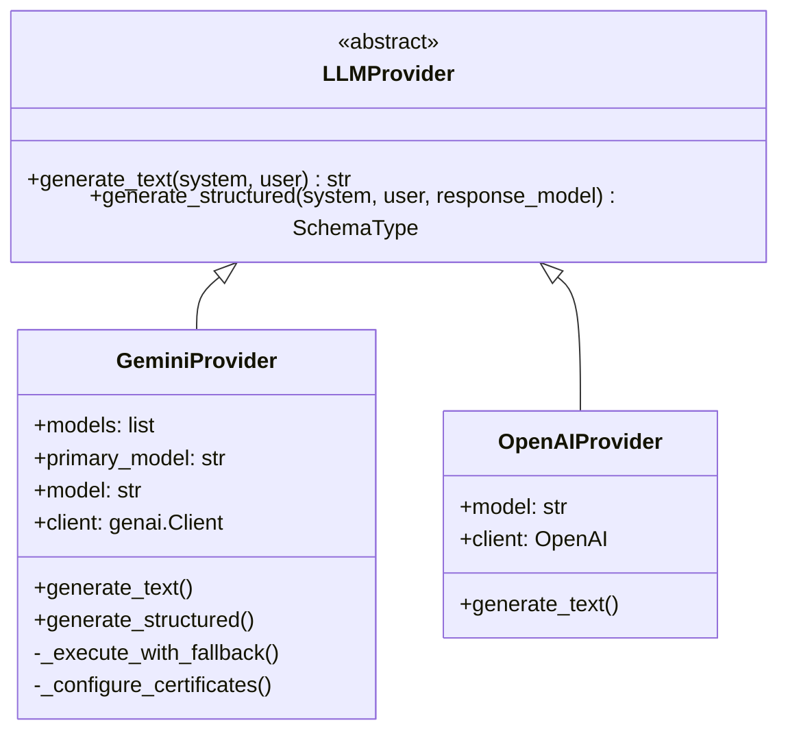
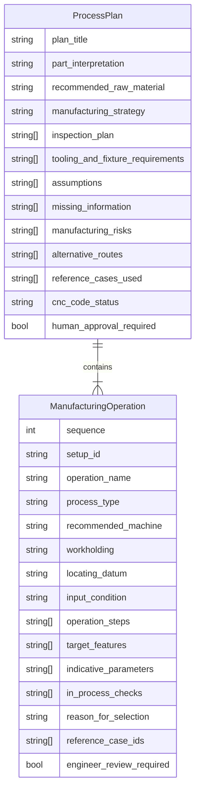
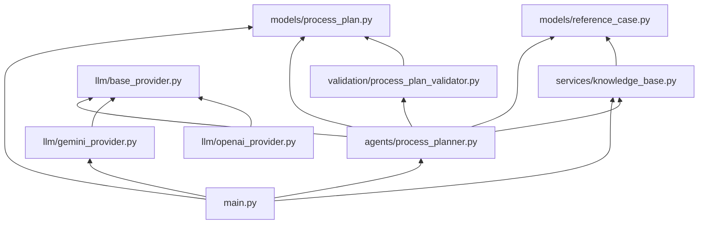

# AI Manufacturing Process Planner — Complete System Overview

**Project root:** `C:\Users\Harsh\Desktop\Agent`  
**Purpose:** Turn a natural-language part description into a grounded, auditable manufacturing process plan using approved shop reference cases and Gemini.

---

## 1. What this system does

```
User describes a part
        ↓
Search 9 approved JSON manufacturing cases
        ↓
Select top 3 reference cases
        ↓
Send description + references to Gemini
        ↓
Gemini returns a structured ProcessPlan (JSON)
        ↓
Validate plan (no CNC code, human approval required)
        ↓
Display plan + save JSON under outputs/
```

The agent recommends **raw material, operation sequence, machines, workholding, datums, inspection, risks, and missing information**.  
It does **not** generate executable G-code / M-code.

---

## 2. Folder architecture

```
Agent/
├── .env                          # Secrets & model names (never commit)
├── .gitignore
├── .venv/                        # Python virtual environment
├── main.py                       # Interactive CLI entry point
├── test_gemini.py                # Gemini connection test
├── gemini_connection_test.py     # Extra connectivity helpers
├── package_check.py
├── validate_syntax.py
├── inspect_database.py
│
├── app/
│   ├── agents/
│   │   └── process_planner.py    # Orchestrates search → LLM → validate → save
│   ├── llm/
│   │   ├── base_provider.py      # Abstract LLM interface
│   │   ├── gemini_provider.py    # Active provider (Gemini Interactions API)
│   │   └── openai_provider.py    # Legacy OpenAI adapter (not used by main.py)
│   ├── models/
│   │   ├── process_plan.py       # Pydantic ProcessPlan schema
│   │   └── reference_case.py     # Dataclass for loaded JSON cases
│   ├── services/
│   │   └── knowledge_base.py     # Load + keyword search over database/
│   └── validation/
│       └── process_plan_validator.py
│
├── database/                     # 9 approved manufacturing reference cases
│   ├── bottom_die_plate.json
│   ├── c45_washer.json
│   ├── en31_hollow_dowel.json
│   ├── hollow_shaft_126164.json
│   ├── ms_slider.json
│   ├── planet_gear_610885.json
│   ├── rotor_lamination_layer.json
│   ├── top_plate.json
│   └── welding_plate_440524.json
│
└── outputs/                      # Generated process plans (JSON)
```

---

## 3. High-level connection diagram



---

## 4. End-to-end request flow



---

## 5. Module responsibilities

| Module | Role |
|--------|------|
| `main.py` | Loads KB + Gemini, interactive loop, pretty-prints plans |
| `ProcessPlannerAgent` | Pipeline owner: search → prompt → structured LLM → enforce rules → validate → save |
| `ManufacturingKnowledgeBase` | Loads all `database/*.json`, builds searchable text, weighted keyword retrieval |
| `ReferenceCase` | Standard wrapper: `case_id`, `part_name`, `material`, `searchable_text`, `raw_data` |
| `ProcessPlan` | Pydantic schema Gemini must fill (operations, inspection, risks, etc.) |
| `LLMProvider` | Abstract API: `generate_text` + `generate_structured` |
| `GeminiProvider` | Active implementation: SSL via truststore, Interactions API, model fallback |
| `OpenAIProvider` | Alternate adapter (Responses API); **not wired into `main.py`** |
| `validate_process_plan` | Deterministic checks: sequences, no G/M codes, approval flags |

---

## 6. Knowledge base & search



**Scoring weights (per matching token):**

| Match location | Weight |
|----------------|--------|
| Part name | +8 |
| Material | +6 |
| Case ID | +5 |
| Full case content | +1 |
| Query coverage bonus | +10 × (matched / total tokens) |

---

## 7. LLM provider design



### GeminiProvider behaviour (current)

1. **SSL:** Before importing GenAI/httpx, inject Windows trust store via `truststore`, or use `GEMINI_CA_BUNDLE` PEM if set.
2. **API:** Google GenAI **Interactions** API (`client.interactions.create`).
3. **Structured output:** Convert `ProcessPlan` → plain JSON Schema → send to Gemini → validate JSON locally with Pydantic.
4. **Fallback:** Try `GEMINI_MODEL`, then models in `GEMINI_FALLBACK_MODELS` on 429 / 404 / 5xx / empty / schema mismatch.
5. **Never disables SSL verification.**

---

## 8. Process plan data model



**Hard rules enforced after LLM response:**

- `cnc_code_status` forced to `"not_generated"`
- `human_approval_required` forced to `True`
- Operations sorted by `sequence`

**Validator rejects / warns on:**

- Empty operations
- Duplicate or out-of-order sequences
- G/M code markers (`G00`, `G01`, `M03`, …)
- Wrong CNC status or disabled human approval
- Missing inspection plan (warning)

---

## 9. Configuration (`.env`)

| Variable | Purpose |
|----------|---------|
| `GEMINI_API_KEY` | Gemini API key (required) |
| `GEMINI_MODEL` | Primary model (e.g. `gemini-3.5-flash`) |
| `GEMINI_FALLBACK_MODELS` | Comma-separated fallback models |
| `GEMINI_CA_BUNDLE` | Optional path to company root CA PEM |
| `OPENAI_API_KEY` / `OPENAI_MODEL` | Only if using OpenAI provider separately |

`.env` is listed in `.gitignore` and must never be committed.

---

## 10. Shop philosophy baked into the agent

Encoded in `ProcessPlannerAgent` system prompt:

- Prefer **manual** machining when practical
- Prefer **DRO drilling** for normal holes
- Use **CNC** only for accuracy / complexity / repeatability / time
- Grinding, wire EDM, heat treatment only when justified
- Respect datums, allowance, distortion, workholding, inspection
- Reference cases are **evidence**, not copy-paste instructions
- Never invent missing drawing data — put gaps in `missing_information`
- No CNC code generation at this stage

---

## 11. How to run

```powershell
cd C:\Users\Harsh\Desktop\Agent

# Activate venv if used
.\.venv\Scripts\Activate.ps1

# Connection smoke test
python test_gemini.py

# Interactive planner
python main.py
```

Example prompt inside `main.py`:

```text
C45 washer requiring accurate bore and outside diameter
```

Result is printed to the terminal and saved as:

```text
outputs/YYYYMMDD_HHMMSS_<slug>.json
```

Each saved file includes: part description, provider/model, retrieved references, full process plan, and validation issues.

---

## 12. Component dependency map



---

## 13. Current status summary

| Area | Status |
|------|--------|
| Folder architecture | In place |
| 9 JSON reference cases | Loaded from `database/` |
| Keyword knowledge-base search | Working |
| Gemini provider + fallback | Active path for `main.py` |
| Structured `ProcessPlan` output | Working (Interactions API + local Pydantic) |
| Validation (no CNC, human approval) | Working |
| CLI + `outputs/` persistence | Working |
| OpenAI provider | Present but unused by main (quota/SSL issues earlier) |

---

## 14. Intended next milestones (not built yet)

1. Richer retrieval (embeddings / semantic search)
2. Drawing upload / PDF interpretation
3. Strict machine/tooling catalog constraints
4. Optional OpenAI provider behind the same `LLMProvider` interface
5. CNC code generation **only after** explicit human approval gate

---

*Generated as a living map of the Agent codebase. Update this file when major modules or flows change.*
